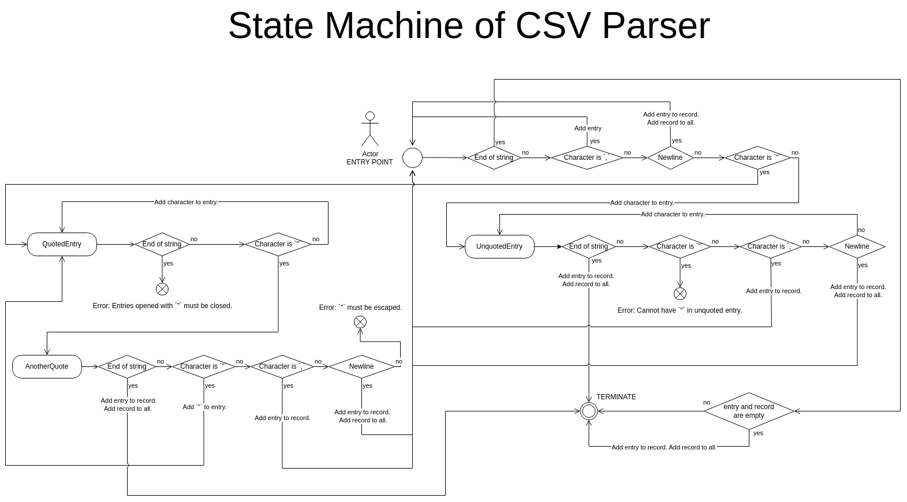

# Serialization and Deserialization of CSV

## CsvSerializer
Static class for serializing and deserializing CSV data. Orignal UML also included methods for reading and writing files, which were opted out of the code, due to SOLID's Single Responsibility Principle. The CsvControll class should not be concerned about where the data is comming from, only about understanding the CSV format. CSV data is not necessarily stored in a file, in the future we might get it through a network connection via the Danfoss API and this way we don't have to first write to a file to deserialize it, so this solution is more general.

### Deserialize
`public static CsvData Deserialize(string rawData, bool includesHeader)`

rawData : the CSV in it's orginal form as a string 
includesHeader : whether the CSV data contains the header in it's first row 
Returns a CsvData object that contains the deserialized CSV.

Deserializes rawData based on the CSV format defined in RFC4180. 
Decided to implement a parser over the original idea of using Regex to match for the data. The best regex foud was `/(?:,|\n|^)("(?:(?:"")*[^"]*)*"|[^",\n]*|(?:\n|$))/g` (https://gist.github.com/awwsmm/886ac0ce0cef517ad7092915f708175f), but opted agianst using it for the following reasons:
- Even this regex is not perfect and requires some post processing, for example it includes the outer double quotes in an entry like `"a"`, so they would need to be removed. And `""` which is a way to escape a `"` in an entry inside quotes, is not possible to parse with any regex, since regex is used for pattern matching not parsing text. Therefore a lot of post processing of the data would still be required.
- It is hard to read, understand and therefore debug.
- Since we would only find mathces that comply with the CSV format we wouldn't know if the rawData is in the correct format in the first place and couldn't throw specific Exceptions like `throw new Exception("Entries can't start with new line.");`

The CSV parser was implemented as a finite-state machine which is illistruated in the following UML diagram:

Side note (as it is not denoted in the diagram): Upon entering a state the next character of the string is being examined.

### Serialize
`public static string Serialize(CsvData data, bool includeHeaderIfNotNull = true)`

data: the data to be serialized into CSV format 
includeHeaderIfNotNull: whether to include the header in the top row of the serialized data if it exists 
Returns a string with the serialized data.

Serializes data based on the CSV format defined in RFC4180. 
Only uses `"` characters when needed.

## CsvData
A class that holds a deserialized form of CSV data. That makes it possible to read your deserialized data as plain text or to convert it into a list of objects fit to hold that data.

### Properties

`public List<string[]> Table { get; private set; }`

`public string[]? Header { get; private set; }`

Table: holds the CSV data as plain text organized a list of arrays. 
Header: holds the header as plain text in an array.

### Constructor

`public CsvData(List<string[]> data, string[]? header = null)`

data: a table of deserialized data as plain text 
header: holds entries of the CSV header

Methods:
### Create\<T\>

`public static CsvData Create<T>(List<T> data, string[]? header = null)`

data: a list of objects to be represented as CSV data 
header: a default header to be used 
Returns the CsvData created from data and header

If header is null a header is created from the list of public properties of the T type. The CSV data will contain the values of the public properties of the T type turned to string via .ToString(), in case a property is null an empty string will be used as an entry.

### ConvertRecords\<T\>

`public List<T> ConvertRecords<T>()`

Converts Table into a list of T. T is created by calling one of T's constructor. If T has only one constructor that one is called, if it has multiple one of them has to be specified my applying the `CsvConstructorAttribute` on it. At most one constructor can have this attribute.
Once a constructor is chosen each record of the Table is converted into type T. In a record the entries are used as the parameters of the constructor. The parameters and the entries are matched by the names of the parameters and the names in the header, this way the constructor is called with the entries in the right ordered. If Header is null or the names in the Headers cannot be matched with names of the parameters then the constructor is called with the with the entires in the order they appear in the row.
All entries are converted to the type of the parameter taken by the constructor.
`var value = Convert.ChangeType(values[i], currentParam.ParameterType);`
