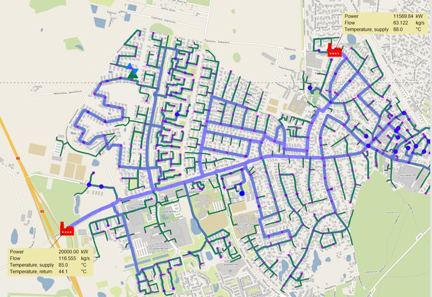
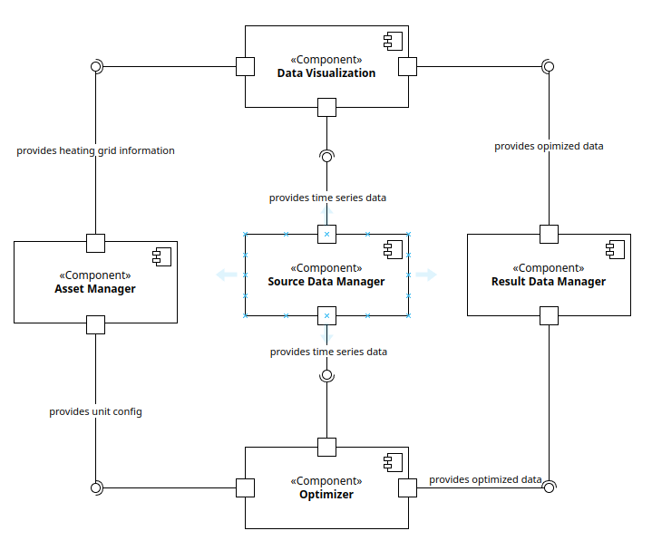
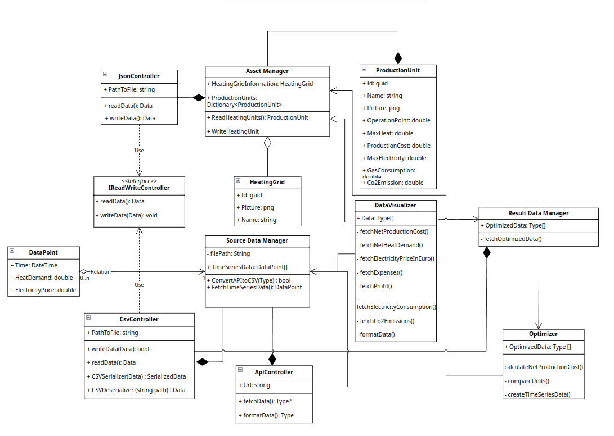
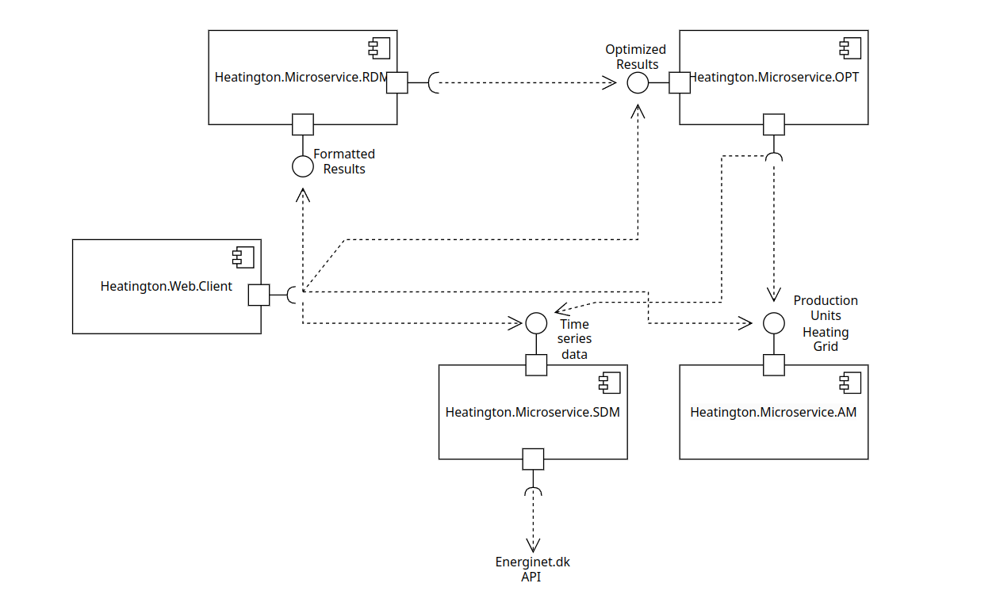

# Heatington

> [Open Coding Style Guidelines](./docs/CODING-STYLE.md)

> [How to install Docfx](./docs/introduction.md)

> [Code Documentation](https://sdu-semester-project-2.github.io/Heatington/)

## _HOW TO RUN THE APP_
### `dotnet run`
Open 5 terminal emulator windows(in the root directory) and in each run following pair of commands
```shell
# 1
cd Heatington.Microservice.AM
dotnet watch
# 2
cd Heatington.Microservice.SDM
dotnet watch
# 3
cd Heatington.Microservice.RDM
dotnet watch
# 4
cd Heatington.Microservice.OPT
dotnet watch
# 5
cd Heatington.Web
dotnet watch
```


### `Make` (Potentially not working)
#### Running the Console App
```shell
make run_console
```

#### Running the Web App
```shell
make
```
there is an `DEV` variable inside of `Makefile` you can set it to false to turn off the hot reload


## What are we developing
- Heat production optimization for a district heating utility
  - Secure heat availability for all buildings in the district heating network
  - Produce heat for the lowest costs
  - Utilize the electricity market for the highest profit or lowest costs
- Five Components
  - Asset Manager (AM)
  - Source Data Manager (SDM)
  - Result Data Manager (RDM)
  - Optimizer (OPT)
  - Data Visualization (DV)
- Two Scenarios
  - Single heating area, one gas boiler, one oil boiler
  - Single heating area, one gas boiler, one oil boiler, one gas motor, one electric boiler
- Two Periods
  - Winter period
  - Summer Period

## Example of heating net


## Component Diagram



---
## Class Diagram



## Microservices Diagram


