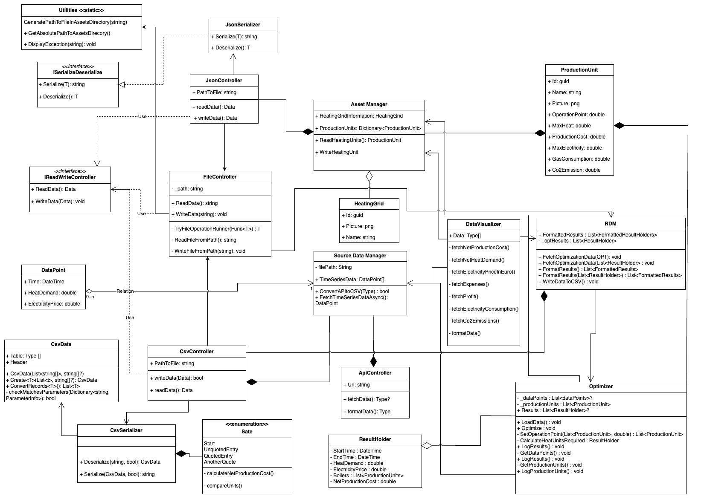

# Heatington

> [Open Coding Style Guidelines](./docs/CODING-STYLE.md)

> [How to install Docfx](./docs/introduction.md)

## What are we developing
- Heat production optimization for a district heating utility
  - Secure heat availability for all buildings in the district heating network
  - Produce heat for the lowest costs
  - Utilize the electricity market for the highest profit or lowest costs
- Five Components
  - Asset Manager (AM)
  - Source Data Manager (SDM)
  - Result Data Manager (RDM)
  - Optimizer (OPT)
  - Data Visualization (DV)
- Two Scenarios
  - Single heating area, one gas boiler, one oil boiler
  - Single heating area, one gas boiler, one oil boiler, one gas motor, one electric boiler
- Two Periods
  - Winter period
  - Summer Period

## Example of heating net

## Component Diagram

---
## Class Diagram

